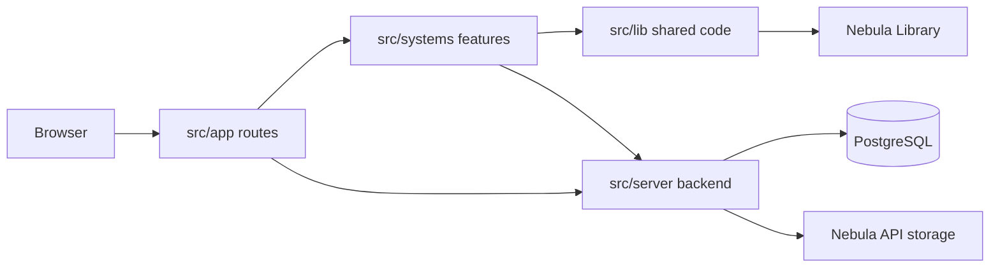

# UTD Notebook developer wiki

UTD Notebook helps students find, share, save, rate, and report course notes.
This wiki explains how the project works and how to make changes without
getting lost in the codebase.

## Contents

- [Start here](#start-here)
- [Architecture at a glance](#architecture-at-a-glance)
- [Main systems](#main-systems)
- [Local setup](#local-setup)

## Start here

- [Getting started](./getting-started.md) walks through a complete local setup.
- [Project architecture](./project-architecture.md) explains how a request
  moves through the app, server, database, and storage service.
- [Project structure](./project-structure.md) shows where each kind of code
  belongs.
- [How to contribute](./how-to-contribute.md) covers branches, checks, commits,
  pull requests, and review expectations.

## Architecture at a glance

Most requests begin in a small Next.js entrypoint. The entrypoint hands the
work to a feature system, and that system uses shared project code or the
server when it needs them.



The important idea is that `src/app` names routes but does not own feature
behavior. Search behavior belongs to the search system, note behavior belongs
to the notes system, and reusable pieces belong in `src/lib`.

## Main systems

| System       | What you will find there                                   |
| ------------ | ---------------------------------------------------------- |
| `account`    | Sign in, onboarding, profiles, and settings                |
| `moderation` | Reports and administrative review screens                  |
| `notes`      | Note pages, uploads, editing, saving, ratings, and PDFs    |
| `search`     | Search UI, autocomplete handlers, datasets, and generators |

## Local setup

### 1. Check the required tools

Install Git and Node.js 22. You can confirm the active versions with:

```bash
git --version
node --version
npm --version
```

### 2. Clone the project and its submodule

```bash
git clone https://github.com/UTDNebula/utd-notebook.git --recurse-submodules
cd utd-notebook
```

If you already cloned the project without the submodule, run:

```bash
git submodule update --init --recursive
```

### 3. Install dependencies

Use the committed lockfile so everyone gets the same dependency versions:

```bash
npm ci
```

### 4. Create your environment file

Copy the example file, then fill in the private values through an authorized
project channel:

```bash
cp .env.example .env
```

Never paste real credentials into chat, issues, screenshots, or documentation.

### 5. Start the app

```bash
npm run dev
```

Open `http://localhost:3000`. The terminal should show a successful request
when the home page loads.

### 6. Check your setup

Once the app starts, run the check-only commands:

```bash
npm run lint:check
npm run format:check
npm run type:check
```

For environment details and common setup problems, continue with
[Getting started](./getting-started.md).
