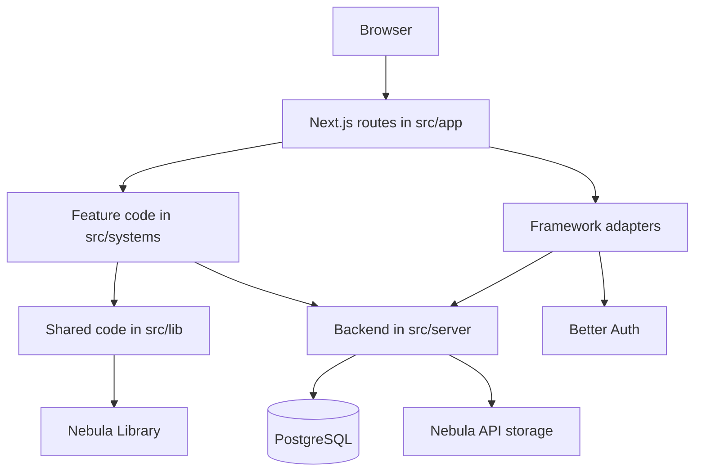
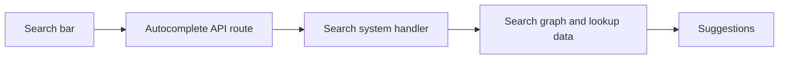
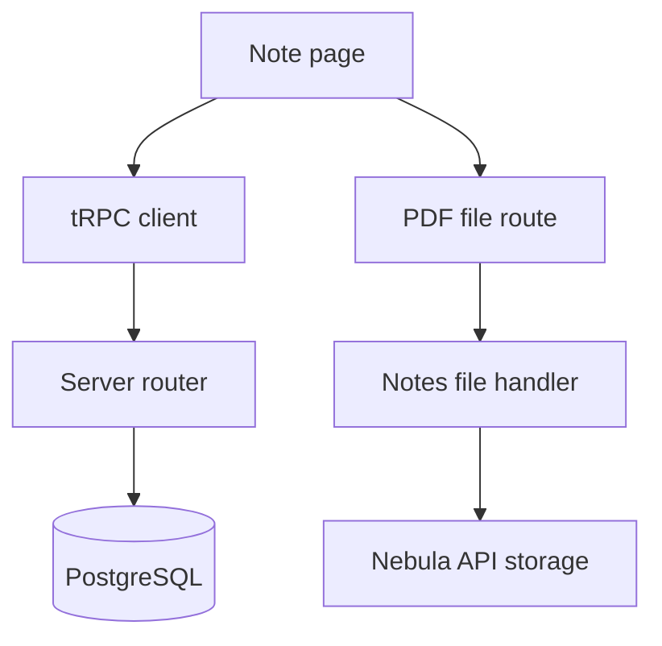
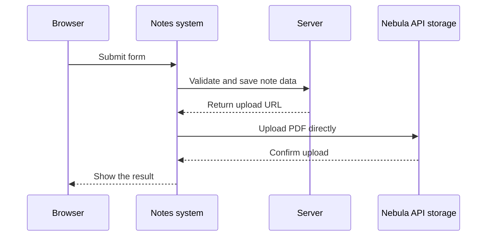

# Project architecture

UTD Notebook is a Next.js application built around four feature systems:
account, moderation, notes, and search. This page explains how those systems
work together and what happens when a request moves through the application.

## Contents

- [How the pieces connect](#how-the-pieces-connect)
- [Design principles](#design-principles)
- [Rendering and state](#rendering-and-state)
- [Common request paths](#common-request-paths)
- [The backend boundary](#the-backend-boundary)
- [Main libraries](#main-libraries)
- [Generated search data](#generated-search-data)
- [Security and configuration](#security-and-configuration)

## How the pieces connect

Most browser requests first reach a small route in `src/app`. That route hands
the work to the feature that owns it. Feature code can use shared Notebook code
from `src/lib` and backend services from `src/server`.



The direction matters. Routes can use systems, systems can use shared code and
the server, and lower layers do not reach back into routes or features. Keeping
that direction clear makes ownership easier to understand and helps avoid
circular dependencies.

## Design principles

1. **Routes introduce a request.** Files in `src/app` satisfy Next.js routing
   rules, then pass the work to the code that owns it.
2. **Features keep related work together.** Pages, components, browser hooks,
   handlers, data, and scripts stay with their account, moderation, notes, or
   search system.
3. **Shared code has a clear purpose.** Reusable Notebook code belongs in a
   named area under `src/lib`, not in a catch-all collection.
4. **Backend work stays centralized.** Authentication, database access,
   storage, and tRPC procedures live under `src/server`.
5. **Tools reinforce the boundaries.** TypeScript, Zod, tRPC, and ESLint help
   keep contracts between layers explicit.
6. **Refactors preserve behavior.** A structural change should not quietly
   include a product or visual change.

## Rendering and state

Server components load data and build the first version of a page when that
fits the request. Client components take over for forms, menus, search,
notifications, uploads, and other browser interactions.

TanStack Query and the tRPC React integration manage data that comes from the
server. TanStack Form and Zod handle form state and validation. Small pieces of
interface state stay inside their component unless several parts of the app
clearly need to share them.

## Common request paths

### Search and autocomplete

The search bar calls one of the autocomplete routes. The route stays small and
passes the request to the search system, which reads generated lookup data.



The generation scripts live in `src/systems/search/scripts`, and their output
lives in `src/systems/search/data`. The normalized section dataset is shared
with the server, so it lives in `src/lib/sections`.

### Reading a note

Note information and the PDF take different paths. tRPC loads the database
record, while a dedicated file route validates and retrieves the PDF from
Nebula API storage.



Before returning a PDF, the file handler checks the note identifier, storage
metadata, MIME type, file size, and PDF signature. It does not trust a legacy
public URL or follow a redirect to another site.

### Creating or editing a note

The notes system owns the forms and upload behavior. Shared controls and note
schemas come from `src/lib`. The server creates or updates the database record
and provides a short-lived upload URL for the PDF.



### Authentication and account data

The Better Auth adapter is exposed through
`src/app/api/auth/[...all]/route.ts`. Its configuration and database
integration live in `src/server/auth.ts`. Sign-in screens, onboarding,
profiles, and settings belong to the account system.

### Reports and moderation

The moderation system owns the report form and admin screens. Report
procedures and persistence stay in the server layer, where authentication and
authorization can be enforced.

## The backend boundary

`src/server/api/root.ts` combines the application routers. Each router owns a
focused set of procedures for files, reports, saved notes, sections, storage,
or user metadata. `src/server/api/trpc.ts` provides request context,
serialization, authentication-aware procedures, and shared tRPC setup.

Drizzle schemas and migrations live together in `src/server/db`. Review a
schema change with its generated migration. Do not rewrite a migration that
has already been applied.

`src/server/storage.ts` is the shared transport for authenticated Nebula API
storage requests. Storage credentials stay on the server.

## Main libraries

| Area                 | Main tools and responsibility                              |
| -------------------- | ---------------------------------------------------------- |
| Application          | Next.js, React, and TypeScript                             |
| Interface            | Material UI, Emotion, Tailwind CSS, and Nebula Library     |
| Forms and validation | TanStack Form, Zod, and drizzle-zod                        |
| Data transport       | tRPC, TanStack Query, and SuperJSON                        |
| Authentication       | Better Auth with Google and Discord OAuth                  |
| Database             | Drizzle ORM and PostgreSQL                                 |
| Search               | Graphology, autosuggest-highlight, and generated JSON data |
| Files                | Nebula API storage, pdf-thumbnail, and Sharp               |
| Dates                | date-fns and Material UI date pickers                      |
| Observability        | Sentry and Google Analytics                                |

An installed package may support build tooling or planned work even when it
is not imported directly by the current application. Treat dependency removal
as a separate, reviewed change.

## Generated search data

These commands rebuild the committed search data:

```bash
npm run fetchdata
npm run buildautocomplete
npm run buildcoursenames
npm run buildsections
```

Keeping the generated JSON in the repository means a build does not depend on
a live course-data service. Review generated changes and do not edit those
files by hand.

## Security and configuration

`src/env.mjs` defines the environment values expected by the application.
Only variables that begin with `NEXT_PUBLIC_` may be read by browser code.
Database, OAuth, Better Auth, and Nebula API credentials are server-only.

Never place real secrets in source files, committed environment files, issues,
pull requests, chat messages, screenshots, or documentation. Use approved
development credentials locally and repository secrets in automation.

Uploads and downloads cross an external storage boundary. Keep identifier,
type, size, signature, redirect, and timeout checks in place when changing
that path. Authentication and authorization checks belong at the server
boundary, not only in the interface.

See [Project structure](./project-structure.md) for exact code ownership and
[How to contribute](./how-to-contribute.md) for the review process.
