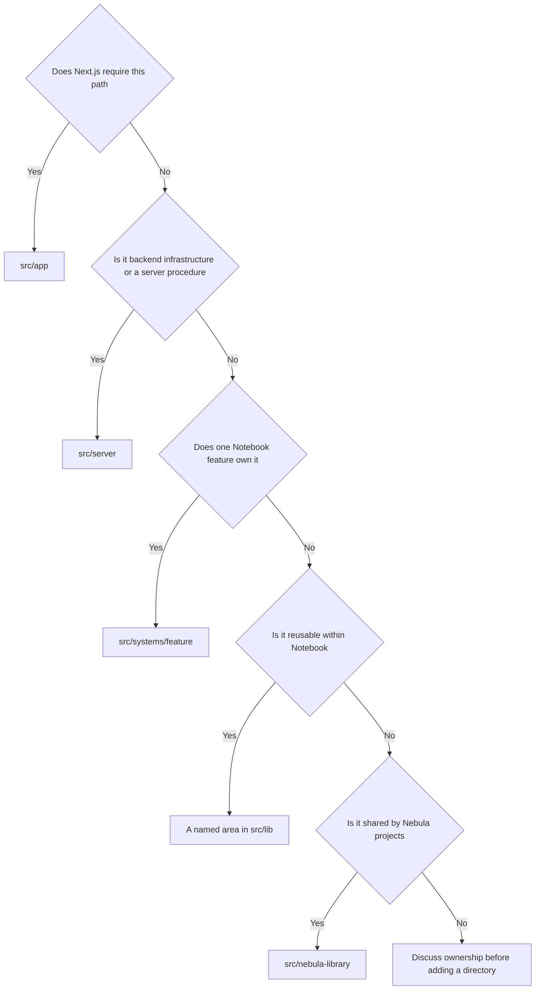

# Project structure

This page is a map of the codebase. Use it when you need to find an existing
feature or decide where a new file belongs.

## Contents

- [Source tree](#source-tree)
- [Choosing a location](#choosing-a-location)
- [App: routing only](#app-routing-only)
- [Systems: feature ownership](#systems-feature-ownership)
- [Lib: shared project code](#lib-shared-project-code)
- [Server: backend code](#server-backend-code)
- [Nebula Library](#nebula-library)
- [Import boundaries](#import-boundaries)

## Source tree

```text
src/
├── app/                       Next.js routes and framework entrypoints
├── lib/                       Reusable Notebook code and primitives
├── systems/                   Feature-owned application code
├── server/                    Authentication, database, storage, and tRPC
├── nebula-library/            Shared Nebula component-library submodule
├── env.mjs                    Environment configuration
├── instrumentation.ts         Server instrumentation
└── instrumentation-client.ts  Browser instrumentation
```

## Choosing a location

Start with the question at the top of this diagram and follow the first answer
that fits. If none of them fit, talk through ownership before creating a new
top-level directory.



## App: routing only

`src/app` defines the App Router contract. Most pages and API routes are small
entrypoints that hand control to a system or framework adapter.

```text
app/
├── admin/                       Moderation entrypoints
├── api/
│   ├── auth/[...all]/route.ts   Better Auth adapter
│   ├── autocomplete/route.ts    Search handler entrypoint
│   ├── courseNameAutocomplete/  Search handler entrypoint
│   ├── files/[id]/route.ts      Note PDF handler entrypoint
│   └── trpc/[trpc]/route.ts     tRPC HTTP adapter
├── auth/                        Account entrypoint
├── get-started/                 Account onboarding entrypoint
├── notes/                       Note page entrypoints
├── profile/                     Account profile entrypoints
├── report/                      Moderation entrypoint
├── settings/                    Account entrypoint
├── layout.tsx                   Root providers and metadata
├── global-error.tsx             Next.js global error boundary
├── sitemap.ts                   Dynamic sitemap
└── manifest and icon files      Next.js metadata files
```

Framework adapters can contain the wiring their framework requires. Feature
behavior does not belong here. A page will usually delegate to a file under
`src/systems/<feature>/pages`.

## Systems: feature ownership

Each folder in `src/systems` owns one major Notebook capability. A system can
use `src/lib` and `src/server`, but it cannot import routes from `src/app`.

### Account

```text
systems/account/
├── components/
│   ├── getting-started/   Onboarding wizard
│   ├── profile/           Profile note lists
│   └── settings/          Account settings forms
├── data/utdDegrees.ts     Major and minor choices
└── pages/                 Auth, onboarding, settings, and profile screens
```

Start here for sign-in screens, first-time user setup, profile presentation,
or account settings.

### Moderation

```text
systems/moderation/
├── components/   Report form and admin header
└── pages/        Report and admin screens
```

This system owns the user-facing report and admin flows. Their server
procedures stay in `src/server/api/routers`.

### Notes

```text
systems/notes/
├── api/file.ts            Validated PDF delivery handler
├── components/            Cards, grids, details, ratings, and actions
├── forms/                 Create and edit note forms
├── hooks/                 Browser upload behavior
├── pages/                 Note list, detail, create, and edit screens
└── utils/noteSlug.ts      Route parsing and display text
```

Start here for note cards, PDFs, uploads, editing, saving, ratings, and note
page behavior.

### Search

```text
systems/search/
├── api/                    Autocomplete request handlers
├── components/             Search bar and search-aware header
├── data/                   Generated autocomplete datasets
├── pages/HomePage.tsx      Search-oriented home screen
├── scripts/                Dataset fetch and generation scripts
└── utils/                  Search query and graph logic
```

The scripts write generated files back into the search system. The shared
section list is the exception. It lives in `src/lib/sections` because the
server also uses it.

## Lib: shared project code

`src/lib` contains code that is reusable within Notebook. Give shared code a
named home instead of dropping unrelated files into `lib/utils`.

```text
lib/
├── components/
│   ├── form/              TanStack Form controls and registration
│   └── shared controls    Back button, breadcrumbs, confirmation, empty state
├── icons/                 Notebook and authentication icons
├── modules/
│   ├── navigation/        Header shell, profile menu, and sidebar
│   ├── registerModal/     Shared sign-in prompt flow
│   └── snackbar/          Application notifications
├── note-files/            Note file identifiers, limits, and URLs
├── schemas/               Account, moderation, and note validation
├── sections/              Shared section types, normalization, and data
├── styles/                Global CSS and shared visual constants
├── trpc/                  React and server tRPC adapters and query client
├── types/                 Shared transport types
└── utils/                 Small feature-independent helpers
```

Some library files use server types to keep the client and server contract
typed. They still cannot reach upward into a feature system or route.

## Server: backend code

```text
server/
├── api/
│   ├── routers/           File, report, saved-note, section, storage, and user
│   ├── root.ts            Application router composition
│   └── trpc.ts            Context, serialization, auth, and procedures
├── db/
│   ├── migrations/        Ordered SQL migrations and Drizzle metadata
│   ├── schema/            Database tables, enums, and relations
│   ├── index.ts           Database connection
│   └── models.ts          Runtime schemas and inferred model types
├── auth.ts                Better Auth configuration
└── storage.ts             Nebula API storage transport
```

The backend remains centralized. Moving server code into a feature system
would be a broader architecture decision, not a routine file move.

## Nebula Library

`src/nebula-library` is a Git submodule shared by Nebula applications. Import
it through `@nebula-library/*`, not through the Notebook source alias.

A library change has its own branch, commit, and pull request in the Nebula
Library repository. After that change is accepted, Notebook can update the
recorded submodule commit in a separate, easy-to-review change.

## Import boundaries

ESLint enforces the main ownership rules:

- Legacy roots such as `@src/components`, `@src/utils`, and `@src/data` cannot
  be reintroduced through the project source alias.
- Code outside `src/app` cannot import route entrypoints through aliases or
  parent-relative paths.
- `src/lib` and `src/server` cannot import a feature system through aliases or
  parent-relative paths.
- The shared submodule uses the `@nebula-library/*` alias.

If a rule feels awkward, check whether the file is in the right place before
working around the boundary with a long relative path.
